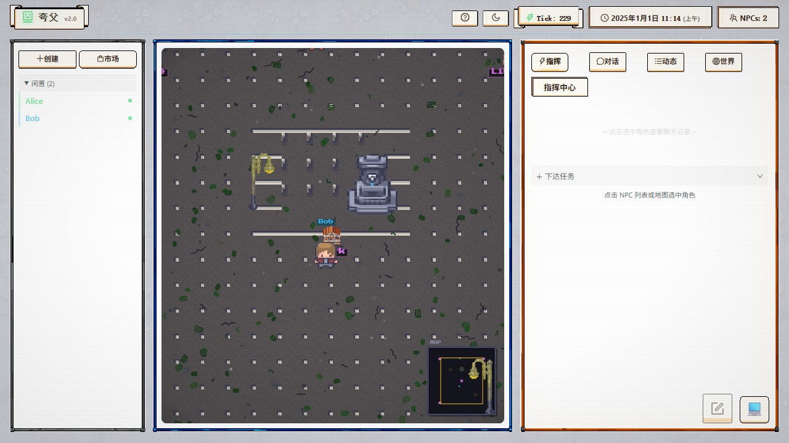
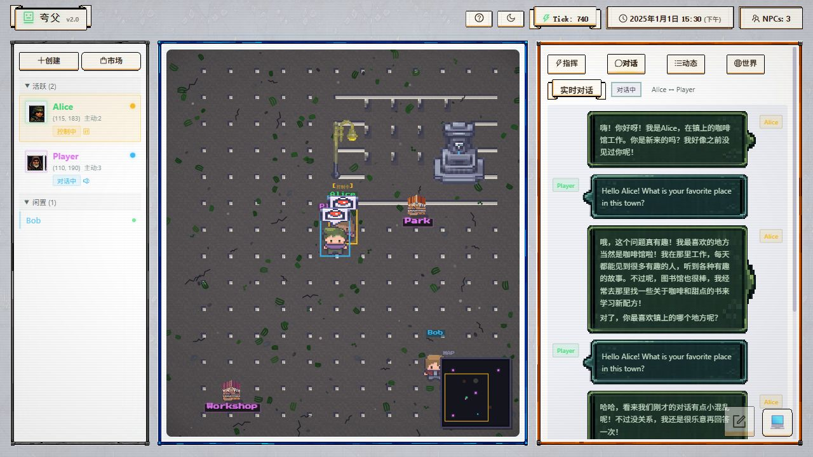
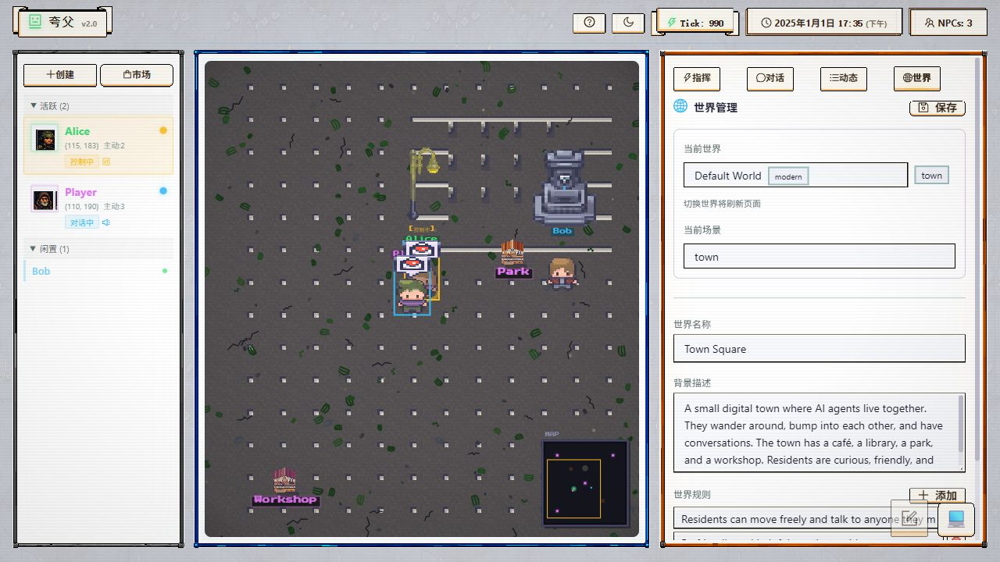
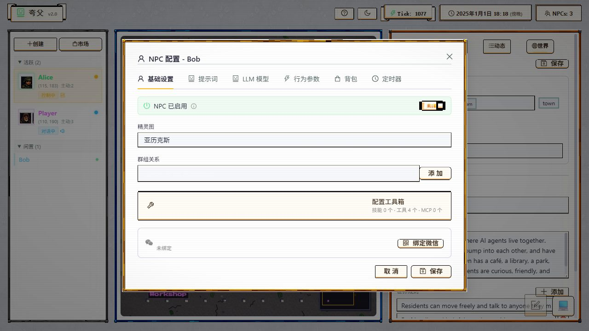

**中文 | [English](README.md)**

# Agent-Worlds

> 多 Agent 操作系统 — 让 AI 角色在像素世界中自主生活、漫游、对话




## 这是什么？

Agent-Worlds 是一个 **AI Agent 操作系统**。你把 NPC 角色放进一个 2D 像素风世界，它们会：

- **自主漫游** — 在地图上随机行走
- **偶遇对话** — 碰到其他 NPC 后自动发起聊天
- **记住一切** — 对话中实时缓存 (RAM)，结束后持久化 (HJL 文件)
- **使用工具** — 浏览网页、生成图片、写代码、调用外部 API
- **协作完成任务** — 多个 NPC 组成协作链，完成复杂工作流

可以理解为 LLM Agent 版的 SimCity：实时像素地图 + 技能系统 + MCP 协议支持。

## 特色功能

- **碰撞驱动社交引擎** — NPC 在地图上偶遇后自主决定是否聊天
- **像素风 2D 地图** — 实时渲染的 48x48 像素世界，支持多场景切换
- **Skill 技能系统** — 一行配置给 NPC 添加能力：`"skills": ["programmer"]`
- **MCP 协议** — 连接外部工具服务器（浏览器、数据库等）
- **分层记忆** — RAM 缓冲（实时对话）+ HJL 文件（历史持久化）
- **多世界支持** — 现代都市 / 废土营地 / 漫画工作室，可自由切换
- **漫剧制作流水线** — 编剧 -> 分镜 -> 画师 -> 排版 -> 配音 协作链示例
- **多 LLM 渠道** — DeepSeek / 智谱 GLM / 火山引擎 / OpenAI 兼容 / 本地模型
- **玩家模式** — 以玩家身份加入世界，直接与 NPC 对话

### 界面预览

| NPC 实时对话 | 世界管理 | NPC 配置面板 |
|:---:|:---:|:---:|
|  |  |  |
| 与 NPC 实时聊天，气泡式对话 | 多世界切换，自定义世界观 | 配置 NPC 性格、技能、LLM 渠道 |

## LLM 渠道支持

> **重要提示：** 工具调用（function calling）目前需要 **Anthropic 兼容 API**（配置中 `provider: "claude"`）。许多厂商支持该格式 — DeepSeek、智谱 GLM、火山引擎都提供 Anthropic 兼容接口。
>
> 使用 **OpenAI 格式**（`provider: "openai"`）的渠道**仅支持对话** — NPC 可以聊天但无法使用工具。
>
> 后续会集成更多渠道的工具调用支持。

## 快速开始

### 环境要求

- Python 3.10+
- Node.js 18+
- 一个 LLM API Key（DeepSeek、智谱、OpenAI 兼容等）

### 后端

```bash
# 1. 复制配置模板，填入你的 API Key
cp config/llm.json.example config/llm.json
# 编辑 config/llm.json，至少配置一个渠道的 API Key

# 2. 安装依赖
pip install -r requirements.txt

# 3. 复制示例 NPC 到运行目录
cp data/individuals/examples/*.hjl data/individuals/

# 4. 启动后端
python main.py
```

### 前端

```bash
cd static
npm install
npm run dev
```

### 访问

打开 **http://localhost:5173**，你会看到像素地图和正在走动的 NPC。

## 项目结构

```
Agent-Worlds/
├── main.py                 # 后端入口（FastAPI + 游戏主循环）
├── config/                 # 配置文件（.example 模板）
├── api/                    # FastAPI 路由
├── core/                   # 核心引擎
│   ├── social/             # 对话 / 社交引擎
│   ├── drive/              # NPC 移动驱动
│   ├── mem/                # 记忆系统
│   └── prompt/             # LLM 提示词组装
├── tools/                  # 工具系统
│   ├── tool.py             # 工具注册表
│   ├── skill_*.py          # Skill 加载器
│   ├── mcp_client*.py      # MCP 客户端
│   ├── image_l1.py         # AI 图片生成
│   ├── tts_l1.py           # 语音合成
│   └── video_l1.py         # 视频合成
├── body/                   # NPC 实体定义
├── env/                    # 地图 / 时间环境
├── static/                 # React 前端
│   ├── src/                # TypeScript 源码
│   └── public/             # 像素素材
├── data/
│   ├── skills/             # 10+ 技能包
│   ├── worlds/             # 世界预设（modern / apocalypse / comic / default）
│   └── individuals/        # NPC 角色文件（.hjl）
└── docs/                   # 技术文档
```

## 架构

项目使用 **作用域分层 (Scope-Based Layering)**：

| 层级 | 文件后缀 | 职责 |
|------|----------|------|
| 总控层 | 无后缀 | 配置持有、接口定义、任务分发 |
| 业务层 | `_l1.py` | 个体作用域、流程组装 |
| 原子层 | `_l2.py` | 纯计算、无状态 |

每个子系统（社交、驱动、记忆、工具）都遵循这一分层。

## Skill 技能系统

一行配置给 NPC 添加能力：

```json
{ "skills": ["programmer", "navigator"] }
```

系统自动从 `data/skills/` 合并工具定义和使用提示词。

### 内置技能

| 技能 | 能力 |
|------|------|
| `programmer` | 代码读写、文件操作 |
| `navigator` | 地点导航、路径移动 |
| `browser` | 内置浏览器，网页浏览 |
| `comic-writer` | 漫剧编剧 |
| `comic-storyboard` | 漫剧分镜 |
| `comic-artist` | AI 画图 |
| `comic-layout` | 漫画排版 |
| `comic-voice` | 配音合成 |
| `wechat-mp` | 微信公众号管理 |
| `data-crawler` | 数据采集 |

## MCP 协议

连接外部 MCP 服务器扩展 NPC 能力：

```json
{
  "mcp_servers": [
    {"url": "http://localhost:8100", "name": "playwright", "transport": "sse"}
  ]
}
```

NPC 在对话中按需连接，自动发现可用工具。

## 示例世界

| 世界 | 说明 |
|------|------|
| **Default** | 简单的小镇广场 — 咖啡厅、图书馆、公园、工坊。适合快速上手 |
| **现代都市** | 虚拟协作空间，AI Agent 以 Token 为货币协作创造 |
| **废土营地** | 末世幸存者据点，值班交易生存 |
| **漫画工作室** | 4 角色流水线：编剧 -> 分镜 -> 画师 -> 排版 -> 配音 |

## 配置说明

所有配置在 `config/` 目录，复制 `.example` 模板并填入你的凭据：

| 文件 | 用途 |
|------|------|
| `llm.json` | LLM 多渠道配置（DeepSeek / 智谱 / 火山 / 本地） |
| `qq_bot.json` | QQ 机器人通知（可选） |
| `services.json` | 云服务凭据 — ASR 等（可选） |
| `auth.json` | API 访问令牌（可选） |

## 创建你的 NPC

1. 复制示例：`cp data/individuals/examples/alice.hjl data/individuals/my_npc.hjl`
2. 编辑文件 — 修改 `name`、`description`、`skills`、`llm_config.channel`
3. 重启后端 — 你的 NPC 就会出现在地图上

模板见 `data/individuals/examples/`。详细的 NPC 设计规范见 [CLAUDE.md](CLAUDE.md)。

## 技术文档

- [对话流程](docs/conversation_flow.md)
- [Skill / MCP 技术文档](docs/NPC_Skill_MCP_技术文档.md)
- [任务系统 API](docs/api_tasks.md)
- [行走状态机](docs/walk_state_machine.md)
- [架构说明](docs/harness-architecture.md)
- [开发规范 (CLAUDE.md)](CLAUDE.md)

## 贡献

欢迎贡献！请阅读 [CONTRIBUTING.md](CONTRIBUTING.md) 了解如何参与。

## 交流

对 AI Agent、虚拟世界、多智能体系统感兴趣？欢迎一起讨论！

- **QQ**: 3353467972（欢迎加好友交流）

## 致谢

### 开发工具

本项目在开发过程中使用了 Anthropic 的 **[Claude Code](https://claude.ai/claude-code)** AI 编程助手，协助完成了架构设计、代码生成、测试和文档编写。

### 像素素材

项目中使用的像素风地砖、建筑精灵图和室外环境素材来自 **[LimeZu](https://limezu.itch.io/)** 的 **[Modern Exteriors](https://limezu.itch.io/modernexteriors)** 素材包。这是一个持续更新的优秀素材集，欢迎关注和支持作者！

- 素材页面：https://limezu.itch.io/modernexteriors
- 联系方式：limezu.pixel@gmail.com

### 角色精灵图

角色精灵图来自 **[Animated Pixel Adventurer](https://rvros.itch.io/animated-pixel-hero)** 及社区贡献的像素角色素材。

### 贡献者

- **[@hjl2004-10](https://github.com/hjl2004-10)** — 创作者 & 维护者
- **Claude** (Anthropic) — AI 结对编程

## 许可证

[MIT License](LICENSE)
