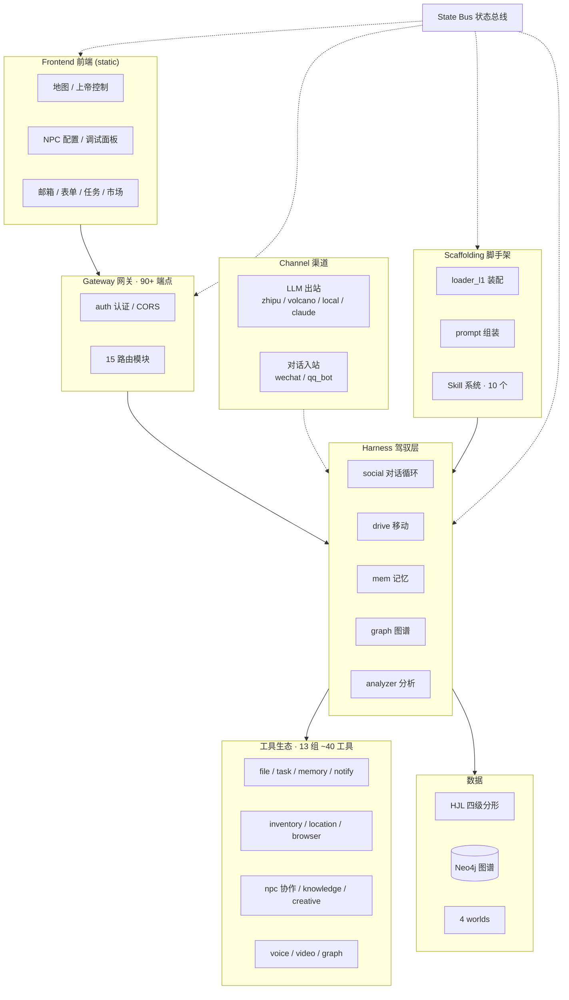
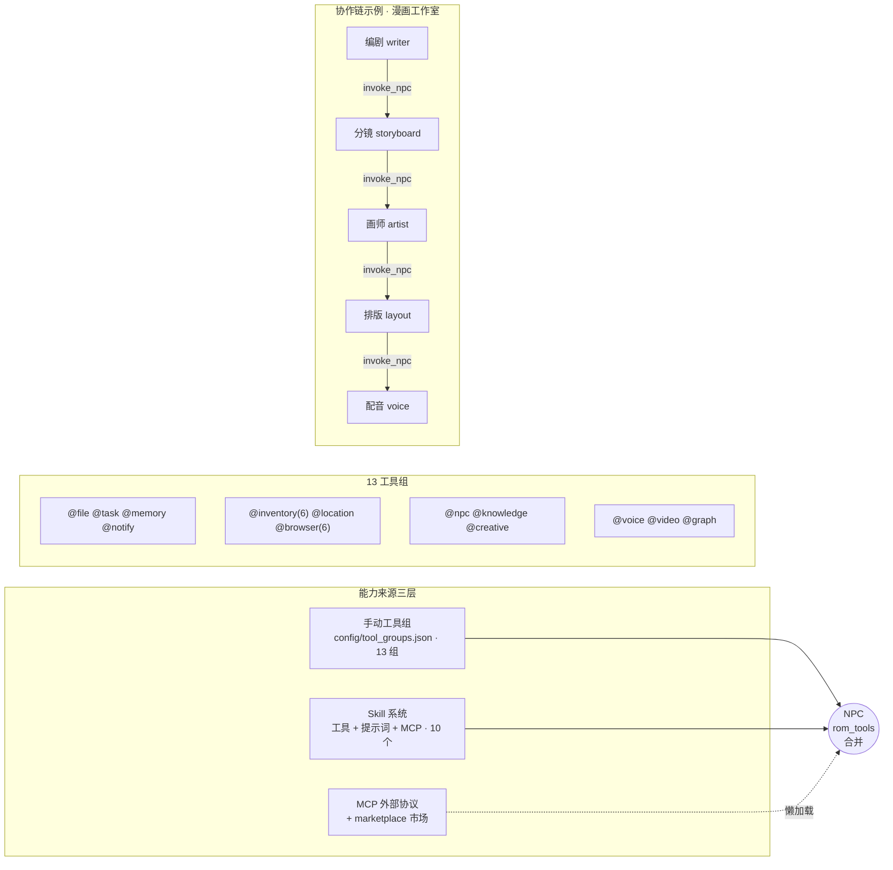
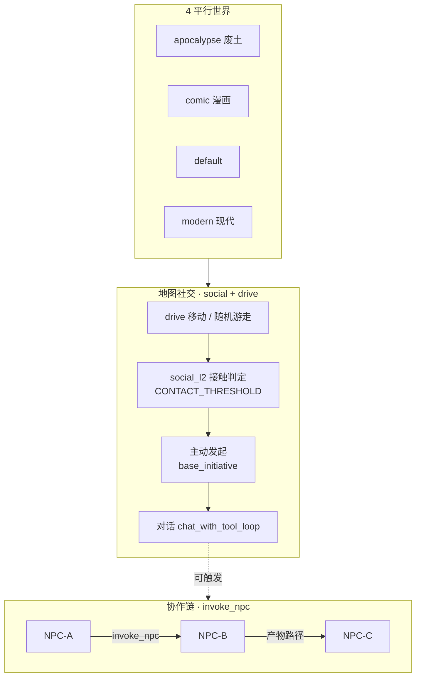
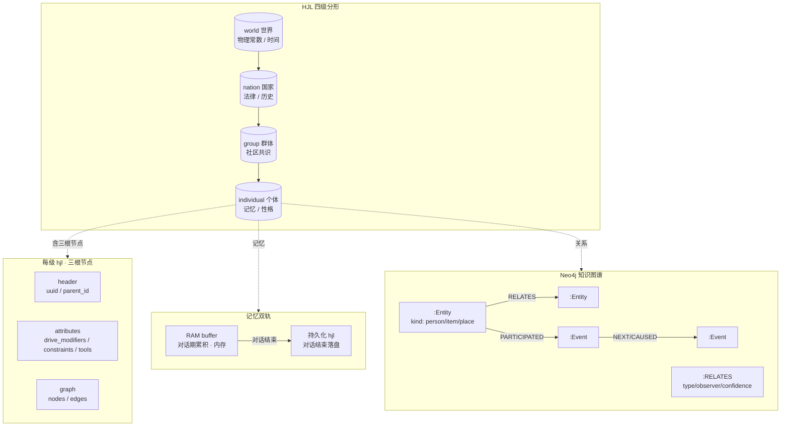
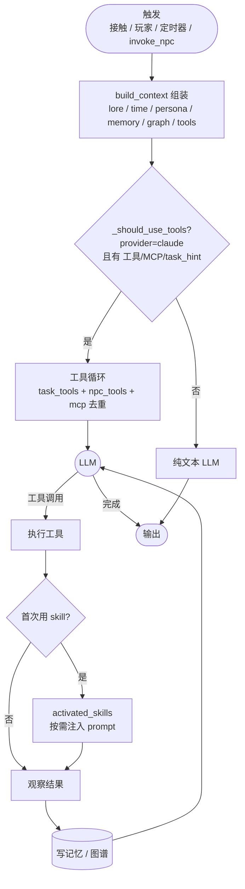
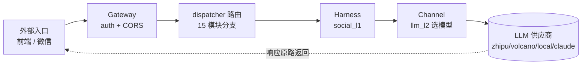

# Agent-Worlds 架构图（Mermaid）

系统核心架构图 / 流程图的 Mermaid 源码。贴入 mermaid.live、Typora、Obsidian 或 GitHub 渲染，也可导出 PNG/SVG 用于文档。

架构图用代码画（Mermaid / PlantUML）是业界标准做法：文字精确、结构清晰、可进 git 版本控制。不用 AI 文生图——其对技术框图的文字与连线渲染不可靠。

符号约定：矩形=模块/过程，菱形=判断，圆角=起止，圆柱=数据存储，实线箭头=主流向，虚线=辅助/事件。

---

## 1. 总架构

---

## 2. 工具与能力生态

---

## 3. 多世界与多 Agent 社交

---

## 4. 数据模型（HJL 分形 + 记忆双轨 + 图谱）

---

## 5. Agentic Loop（一次对话内部）

---

## 6. 请求全链路

---

## 可继续补

- 工具市场 / MCP 生命周期（marketplace 发现 → 装载 → connect_mcp 懒激活）
- 事件关系处理引擎（写入 → engine 归一 → 观察者置信度 → 多视角并存 → 召回聚合）
- 前端调试面板四 Tab 与后端 API 对应
- 精灵图 / 地图渲染管线（sprite layout → 方向帧 → Y-sort → canvas + overlay）
